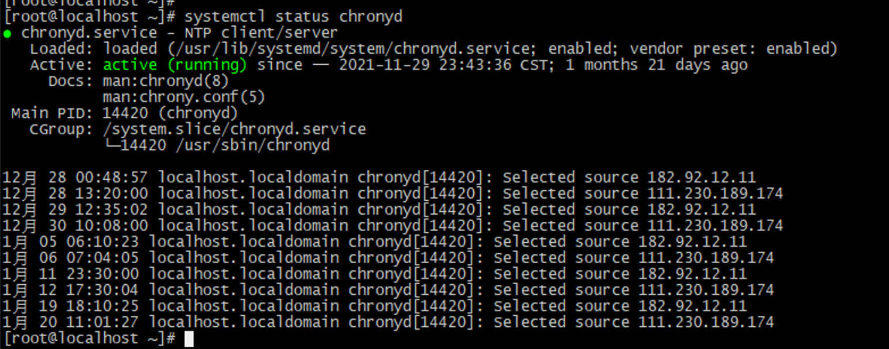
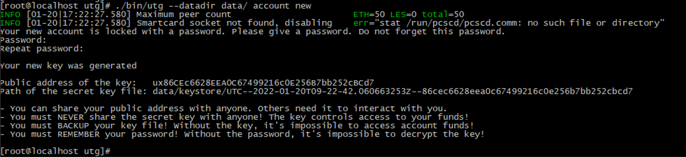

# UltronGlow Validator Node Configuration

Instructions for configurating a Validator Node on the UltronGlow Network.

## Hardware Requirements

| Component      | Requirement          |
|:---------------|:---------------------|
| CPU            | 8 cores              |
| RAM            | 32GB                 |
| OS             | CentOS 7.2 64-bit    |
| Disk (System)  | 100GB                |
| Disk (Data)    | 2TB                  |
| Network        | Internet connection  |

## Directory Structures

* Program directory: `/data/utg/bin`
* Data directory: `/data/utg/data`
* Operation directory: `/data/utg`
* Private key storage directory: `/data/utg/data/keystore`

## 1.  Runtime Environment Preparation

### Upgrade CentOS

```bash
# yum udpate -y
# yum upgrade -y
```

### Deploy time synchronization

```bash
# yum -y install chrony
```

### Start time synchronization

```bash
# systemctl start chronyd
```

### Check time syncronization status

```bash
# systemctl status chronyd
```



### Udpate System Language

```bash
# sudo vim /etc/default/locale
```

```
LANG="en_US.UTG-8"
LANGUAGE="en_US:en"
locale-gen -en_US:en
```

## 2 - Compile the Node Program

```bash
# mkdir -p /data/devent
# cd /data/devent
# git clone --recurse https://github.com/UltronGlow/UltronGlow-Origin.git
# cd UltronGlow-Origin
# make all
```

## 3 - Deploy the Node

### Create the data directory

```bash
# mkdir -p /data/utg/data
```

### Copy the compiled node program to the directory

```bash
# cp -r /data/devent/UltronGlow-Origin/build/bin /data/utg/
```

### Generate the miner address keystore file in the `/data/utg/data/keystore` directory

```bash
# cd /data/utg
# ./bin/utg --datadir data/ account new
```



**Make sure to generate your own password instead of `keypassword` and don't forget it!**

### Write the password for the key file to the `/data/utg/data/password.txt` file.

```bash
# echo 'keypassword' > /data/utg/data/password.txt
```

## 4 - Create the UltronGlow Startup Service

### Start synchronous node mining
   
   ```bash
   # vim /lib/systemd/system/utgchain.service
   ```
   
   ```
   [Unit]
    Description=Ethereum UtgChain
    After=network.target
    
    [Service]
    Type=simple
    StandardOutput=syslog
    StandardError=syslog
    SyslogIdentifier=utg
    User=root
    WorkingDirectory=/data/utg
    ExecStart=/data/utg/bin/utg --datadir /data/utg/data
    KillMode=process
    TimeoutStopSec=60
    Restart=on-failure
    RestartSec=5
    RemainAfterExit=no
    
    [Install]
    WantedBy=multi-user.target
   ```

### Miner node
   ```bash
   # vim /lib/systemd/system/utgchain.service
   ```

   ```
   [Unit]
    Description=Ethereum Utg chain
    After=network.target
    
    [Service]
    Type=simple
    StandardOutput=syslog
    StandardError=syslog
    SyslogIdentifier=utg
    User=root
    WorkingDirectory=/data/utg
    ExecStart=/data/utg/bin/utg --datadir /data/utg/data --allow-insecure-unlock  -unlock <Miner address> --password /data/utg/data/password.txt --mine 
    KillMode=process
    TimeoutStopSec=60
    Restart=on-failure
    RestartSec=5
    RemainAfterExit=no
    
    [Install]
    WantedBy=multi-user.target
   ```

## 5 - Start UltronGlow Node Service

### Create a self-starting node service

```bash
# systemctl enable utgchain
```

### Start the node service

```bash
# systemctl start utgchain
```

### Query the service running status

```bash
# systemctl status utgchain
```

## 6 - Console Check

## Enter the JavaScript console

```bash
# ./bin/utg attach data/utg.ipc
```

### Check the sync status

```
> eth.syncing
```

`True` = Synchronization still in progress

`False` = Synchronization is complete
